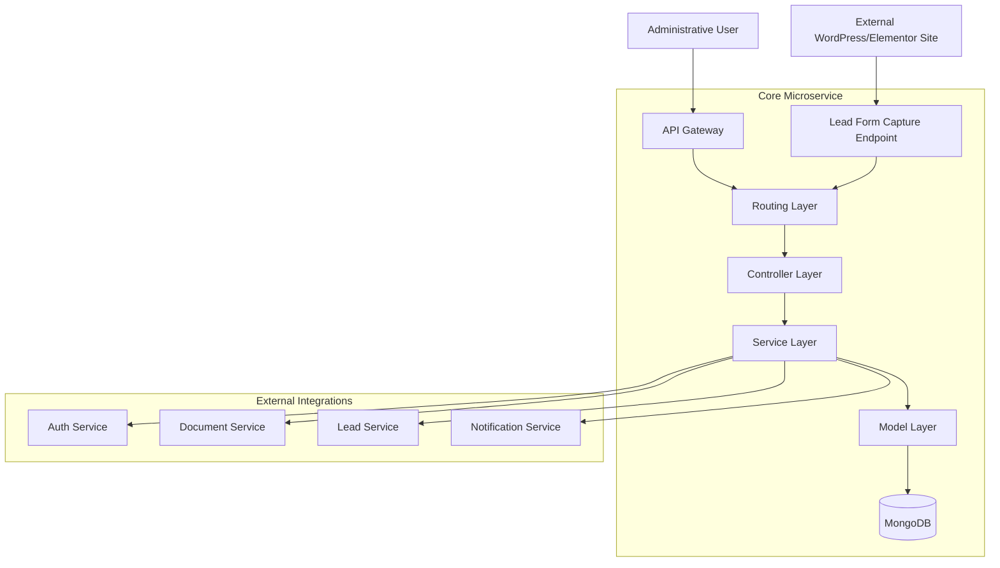
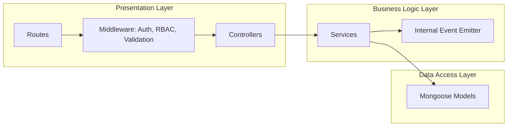
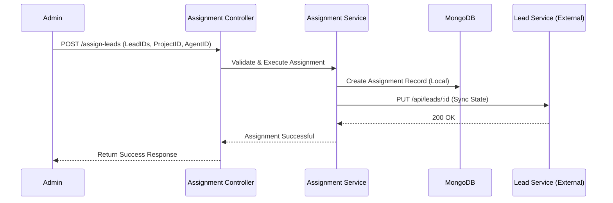
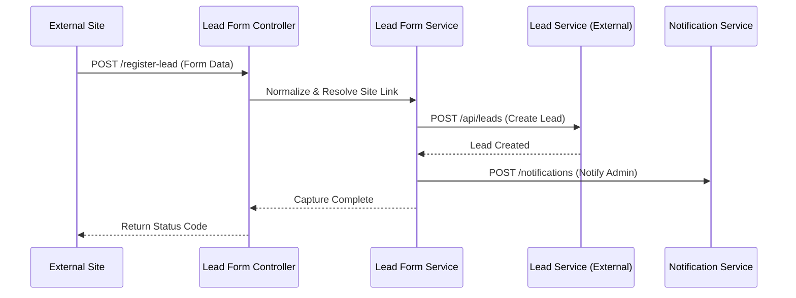
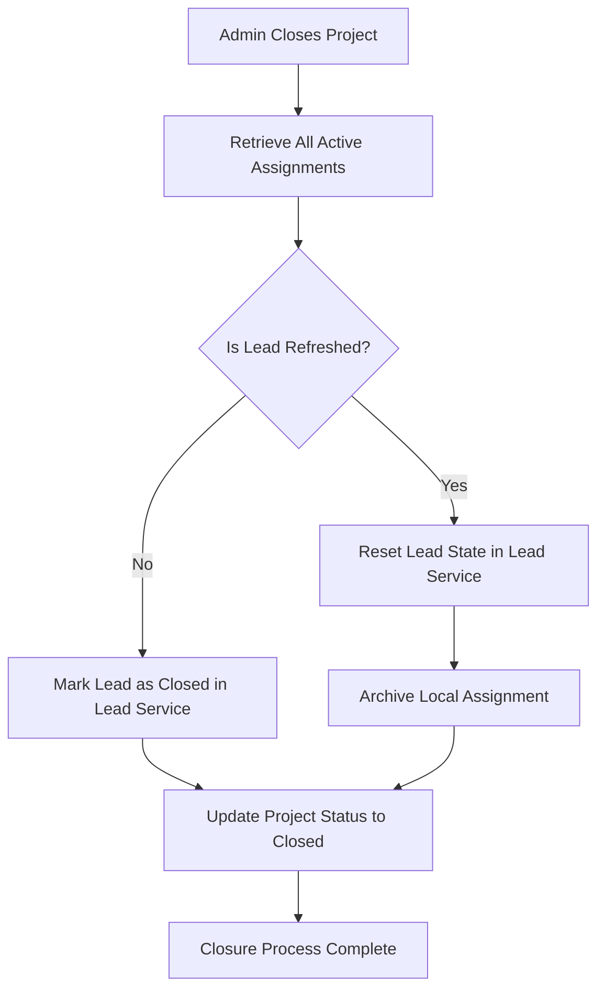
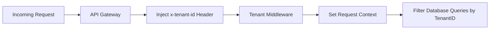

# Configuration Service - Architecture & Data Flow Diagrams

**Version:** 1.0.0  
**Last Updated:** March 2026

---

## 1. System Overview

The Configuration Service is a central administrative microservice designed with a layered architecture to ensure separation of concerns, scalability, and maintainability. It serves as the bridge between administrative configurations and active lead operations.

### 1.1 High-Level Component Architecture

This diagram illustrates the Service's position within the LeadPylot ecosystem and its primary external and internal interaction points.

---

## 2. Internal Layered Architecture

The service follows a strict Controller-Service-Model pattern to decouple request handling, business logic, and data persistence.

---

## 3. Core Data Flows

### 3.1 Lead Assignment Synchronization

The following sequence represents the end-to-end flow when an administrator assigns leads to a specific project and agent.

### 3.2 External Lead Ingestion (Lead Form Capture)

This flow illustrates how external form submissions are captured, cleaned, and broadcasted to the ecosystem.

---

## 4. Project Closure & Lead Refreshing

When a project is closed, the system orchestrates a complex state transition for all associated leads.

---

## 5. Multi-Tenant Context Propagation

The service handles tenant-specific data isolation through a header-based context injection flow.

---

**End of Architecture Documentation**
