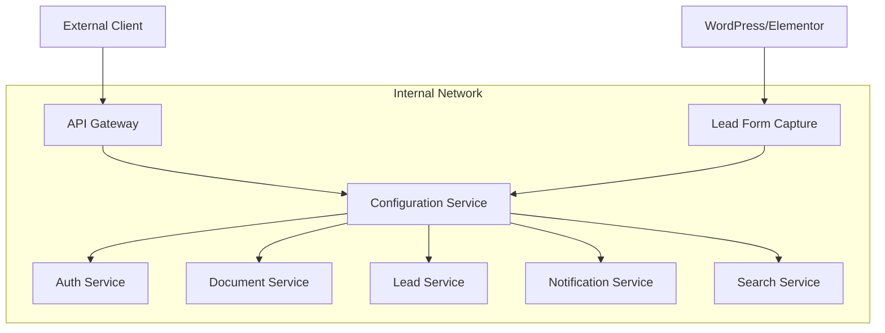
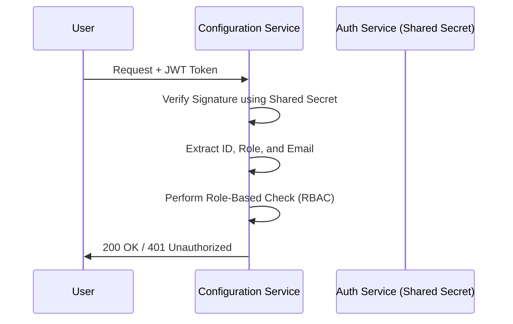
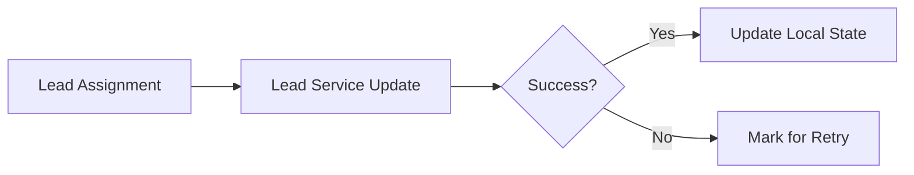
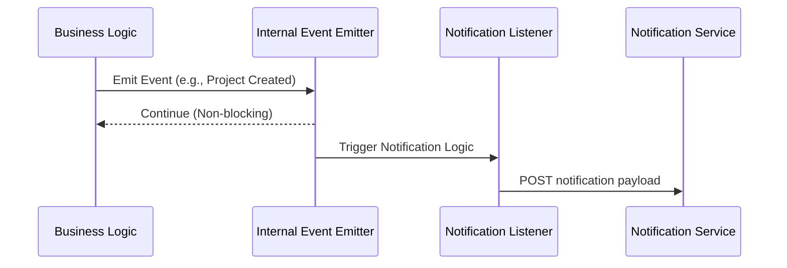
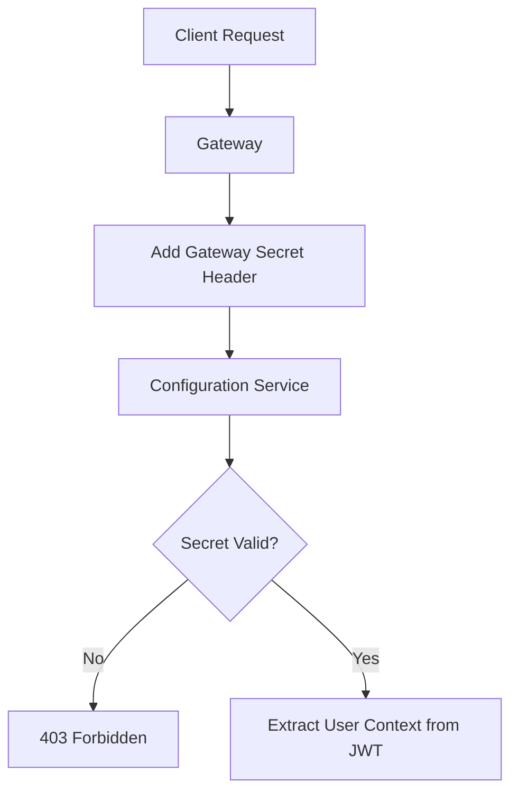

# Configuration Service - Service Integrations

**Version:** 1.2.0  
**Last Updated:** March 2026

---

## Table of Contents

1. [Overview](#1-overview)
2. [Integration Architecture](#2-integration-architecture)
3. [Auth Service Integration](#3-auth-service-integration)
4. [Document Service Integration](#4-document-service-integration)
5. [Lead Service Integration](#5-lead-service-integration)
6. [Notification Service Integration](#6-notification-service-integration)
7. [Search Service Integration](#7-search-service-integration)
8. [Gateway Integration](#8-gateway-integration)
9. [Error Handling & Resilience](#9-error-handling--resilience)
10. [Integration Patterns](#10-integration-patterns)
11. [Security Considerations](#11-security-considerations)
12. [Troubleshooting](#12-troubleshooting)

---

## 1. Overview

The Configuration Service acts as the central administrative hub and integrates with multiple microservices in the LeadPylot ecosystem. This document provides comprehensive details on how the Configuration Service communicates with other services, including authentication mechanisms, data contracts, and integration patterns.

### 1.1 Integration Summary

| Service | Purpose | Communication Pattern | Authentication |
| :--- | :--- | :--- | :--- |
| **Auth Service** | User authentication & authorization | Passive JWT Validation | Shared Secret |
| **Document Service** | File storage (logos, signatures) | Synchronous REST API | JWT Bearer Token |
| **Lead Service** | Lead synchronization & assignments | Synchronous REST API | JWT Bearer Token |
| **Notification Service**| Real-time user alerts | Event-driven HTTP | Internal Events |
| **Search Service** | Advanced full-text search | Synchronous REST API | JWT Bearer Token |
| **Gateway** | Routing and initial security | Header-based Validation | Gateway Secret |

---

## 2. Integration Architecture

The Configuration Service sits behind an API Gateway and communicates with both internal microservices and external sources (like WordPress/Elementor).

### 2.1 Communication Flow Logic

The system utilizes a combination of synchronous and asynchronous patterns:
- **Immediate Data Dependency**: Operations like document uploads or lead status updates use direct synchronous HTTP calls.
- **Side Effects**: Secondary actions like sending a notification or logging an activity are triggered via an internal event emitter to ensure they do not block the primary user request.
- **Context Propagation**: User identity is maintained across service boundaries by propagating the JWT Bearer token in the authorization headers of outgoing requests.

---

## 3. Auth Service Integration

### 3.1 Passive JWT Validation

The Configuration Service does not make a network call to the Auth Service for every request. Instead, it uses a shared secret to cryptographically verify the signature of incoming JWT tokens.

### 3.2 Token Structure Definition

The service expects a standard JWT payload containing the following identity markers:

| Field | Description |
| :--- | :--- |
| **_id / id** | Unique user identifier. |
| **login / username** | User's system login name. |
| **email** | Registered email address. |
| **role** | User permission level (Admin, Supervisor, Agent). |
| **sessionId** | Pointer to the active session for logging. |

---

## 4. Document Service Integration

### 4.1 Implementation Framework

The Configuration Service utilizes a dedicated client to manage organizational assets. All file-related operations (logos, signatures) are handled through this integration.

| Action | Technical Description |
| :--- | :--- |
| **Asset Registration** | Uploads a binary file (Bank logo, user signature) and returns a unique reference ID. |
| **Metadata Retrieval** | Fetches file URLs and dimensions using the reference ID. |
| **Cleanup** | Orchestrates the deletion of associated files when the parent entity (Bank/Template) is removed. |

### 4.2 Document Categorization

Files are tagged with specific types during the upload process to ensure proper storage and access rules:
- **extra**: Organizational assets like Bank logos.
- **signature**: Professional email signatures used in communication templates.
- **template**: Base PDF files used for automated document generation mapping.

---

## 5. Lead Service Integration

### 5.1 Overview

Consistency between the administrative configuration and the active lead database is maintained via a set of synchronization points.

### 5.2 Integration Scenarios

| Scenario | Lead Service Action Required |
| :--- | :--- |
| **New Assignment** | Update lead ownership (agent_id) and link it to the project (project_id). |
| **Project Closure** | Bulk update lead states to either "new" (refreshed) or "closed" (archived). |
| **Reverting Leads** | Move lead data from the Configuration Service's archive back to the Lead Service's active pool. |
| **Lead Re-assignment**| Update the current owner and record the previous owner for history. |

### 5.3 Data Consistency Strategy

The Configuration Service employs a "Local-First" pattern for assignments:
1. The administrative record is created in the Configuration DB.
2. A request is dispatched to the Lead Service to update the lead's operational state.
3. If the external update fails, the local record is marked for eventual consistency or retry, ensuring the system remains resilient to temporary network issues.

---

## 6. Notification Service Integration

### 6.1 Event-Driven Notifications

To avoid latency during administrative actions, notifications are dispatched as fire-and-forget events.

### 6.2 Key Triggers

Notifications are automatically generated for:
- **Project Creation**: Notifies administrators of new containers.
- **Form Submission**: Alerts relevant teams of new leads captured via external forms.
- **System Thresholds**: Notifications triggered by specific business rule violations.

---

## 7. Search Service Integration

For complex, cross-collection search requirements that exceed standard MongoDB capabilities, the service utilizes a Search Service integration.

| Parameter | Description |
| :--- | :--- |
| **Model Scope** | Specifies which collection to search (Project, Bank, Lead). |
| **Search Terms** | Keywords for full-text lookup. |
| **Complex Filters**| Nested logic for filtering by status, date ranges, or tags. |
| **Fallback Mechanism**| If the Search Service is unavailable, the system automatically degrades to direct MongoDB queries. |

---

## 8. Gateway Integration

### 8.1 Gateway Security Protocol

The Gateway enforces a strict perimeter around the microservice.

---

## 9. Error Handling & Resilience

### 9.1 Resilience Strategies

The Configuration Service implements several patterns to handle service unavailability:

- **Timeouts**: Every outgoing call has an enforced time limit (e.g., 60s for file uploads, 5s for notifications) to prevent resource locking.
- **Retry Logic**: Failed synchronization attempts are retried with an exponential backoff.
- **Graceful Degradation**: Critical modules (like Bank management) continue to function even if non-critical services (like Notifications) are offline.
- **Idempotency**: All update operations are designed to be safe to run multiple times in case of retry.

---

## 10. Integration Patterns

| Pattern | Usage |
| :--- | :--- |
| **Synchronous** | Used for operations requiring immediate confirmation (e.g., saving a setting). |
| **Asynchronous** | Used for secondary tasks (e.g., activity logging, notifications). |
| **Token Propagation** | JWT tokens are forwarded to all internal services to maintain security context. |
| **Eventually Consistent**| Lead data and assignments may temporarily diverge during high load or outages, with automated reconciliation. |

---

## 11. Security Considerations

- **Secret Management**: Shared secrets for JWT and Gateway validation are injected via environmental variables and are never hard-coded.
- **Tenant Isolation**: In multi-tenant deployments, the Gateway injects tenant-specific headers which are used to filter all database queries.
- **Payload Validation**: All data received from external sources (especially WordPress webhooks) is sanitized and validated against strict schemas before processing.

---

## 12. Troubleshooting

### 12.1 Common Integration Issues

- **Authentication Failures**: Usually caused by a mismatch in the shared JWT secret or an expired user token.
- **Unreachable Services**: Indicated by "Connection Refused" or "Timeout" errors in the logs. Verify the service URLs and network connectivity.
- **Forbidden Access**: Occurs when the Gateway secret is missing or incorrect, preventing communication between the reverse proxy and the service.
- **Capacity Errors**: High-volume lead ingestion from external forms can trigger rate limits; monitor concurrent connection counts.

---

**End of Document**
