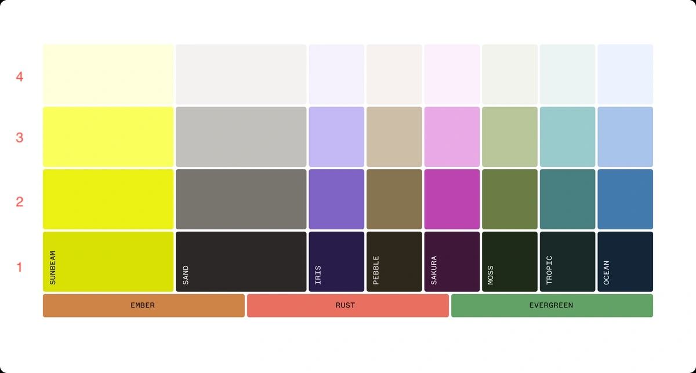

# Dashboard Frontend

## Prerequisites

- [Node.js](https://nodejs.org/) version 18.18 or later
- [npm](https://www.npmjs.com/) (comes with Node.js)
- [Docker](https://www.docker.com/) (optional, for containerized development)

## Development Setup

You can run this project either locally or using Docker. Choose the method that best suits your workflow.

### Local Development

1. Install dependencies:

   ```bash
   npm install
   ```

2. Start the development server:

   ```bash
   npm run dev
   ```

### Docker Development (Recommended)

This method ensures consistency across different development environments and prevents machine-specific issues.

1. Build and start the container:

   ```bash
   docker compose up --build
   ```

2. Open [http://localhost:3001](http://localhost:3001) in your browser.

The Docker setup includes:

- Hot reloading support
- Turbopack for fast refresh
- Volume mounts for local development
- Isolated node_modules

To stop the container:

```bash
docker compose down
```

## Project Structure

```
dashboard-frontend/
├── src/
│   ├── app/              # Next.js app directory
│   │   ├── layout.tsx    # Root layout
│   │   └── users/        # User management module
│   ├── components/       # React components
│   │   ├── ui/          # Reusable UI components
│   │   └── common/      # Common components
│   ├── lib/             # Utility functions and hooks
│   │   ├── hooks/       # Custom React hooks
│   │   └── utils/       # Helper functions
│   ├── services/        # API services
│   └── types/           # TypeScript type definitions
├── public/              # Static assets
├── Dockerfile
├── docker-compose.yml
└── package.json
```

## Key Components

### Color Palette



### Data Table

The data table component (`DataTable`) provides:

- Sorting by columns
- Global search filtering
- Pagination with configurable page size
- URL state persistence
- Responsive design

### Custom Hooks

- `useTable`: Manages table state and functionality
- `useError`: Handles error state and display
- Other utility hooks for common functionality

### Document Preview System

The document preview system provides a complete solution for viewing and downloading various file types including images, PDFs, and other documents. It combines the `DocumentPreviewDialog` component with the `useDocumentPreview` hook for a seamless developer experience.

#### Key Features

- **Comprehensive file support**: Images (jpg, png, gif, webp, svg, etc.), PDFs, and other document types
- **Reliable PDF viewing**: Enhanced PDF detection and blob URL creation with proper MIME type handling
- **Automatic document fetching**: Built-in API integration with React Query for efficient caching
- **Smart contract detection**: Automatically finds and displays contract documents from file collections
- **Full-screen mode**: Toggle between normal and full-screen viewing with responsive design
- **Download functionality**: Built-in download with proper filename handling and loading states
- **Error handling**: Graceful fallbacks when documents fail to load or aren't supported
- **Type-safe API**: Complete TypeScript support with proper type definitions

#### useDocumentPreview Hook (Recommended)

The `useDocumentPreview` hook is the recommended way to implement document viewing. It handles all document logic internally including fetching, blob creation, caching, and state management.

**Basic Implementation:**

```typescript
import DocumentPreviewDialog from '@/components/shared/DocumentPreviewDialog';
import { useDocumentPreview } from '@/hooks/useDocumentPreview';

function MyComponent() {
  // Hook automatically handles document fetching, blob creation, and state management
  const documentPreview = useDocumentPreview();

  const handleViewDocument = (documentId: string, filename: string) => {
    // Auto-detects file type and creates proper preview
    documentPreview.openPreview(documentId, filename);
  };

  return (
    <>
      <Button onClick={() => handleViewDocument('doc-123', 'contract.pdf')}>
        View Contract
      </Button>

      {/* All props handled automatically by the hook */}
      <DocumentPreviewDialog
        {...documentPreview.dialogProps}
        title="Document Preview"
      />
    </>
  );
}
```

**Real-world Example (From OpeningsDashboard):**

```typescript
import { useDocumentPreview } from '@/hooks/useDocumentPreview';
import type { Opening } from '@/services/OpeningsService';

function OpeningsDashboard() {
  // Initialize the hook - no configuration needed
  const documentPreview = useDocumentPreview();

  // Table column for contract viewing
  const columns = [
    {
      id: 'contract',
      header: () => <span>Contract</span>,
      cell: ({ row }) => {
        const opening = row.original;
        const hasFiles = opening.files && opening.files.length > 0;

        return (
          <Button
            icon={<ApolloIcon name="eye-filled" />}
            size="xs"
            variant="default"
            onClick={() => hasFiles && documentPreview.openContractPreview(opening)}
            disabled={!hasFiles}
          >
            View
          </Button>
        );
      },
    },
  ];

  return (
    <>
      <DataTable data={openings} columns={columns} />

      {/* Document preview dialog */}
      <DocumentPreviewDialog
        {...documentPreview.dialogProps}
        title="Document Preview"
      />
    </>
  );
}
```

#### Hook API Reference

```typescript
// Hook initialization
const documentPreview = useDocumentPreview({
  onDownload?: (documentId: string) => Promise<void>; // Custom download handler
  getPreviewUrl?: (documentId: string) => Promise<string>; // Custom preview URL provider
});

// Available state and methods
const {
  // State
  isOpen: boolean;                    // Dialog open state
  isLoading: boolean;                 // Document loading state
  isDownloading: boolean;             // Download loading state
  previewUrl: string | null;          // Generated blob URL
  previewType: 'pdf' | 'image' | 'other'; // Detected file type
  documentName?: string;              // Document filename
  selectedDocumentId?: string;        // Current document ID

  // Actions
  openPreview: (id: string, name: string, type?: 'pdf' | 'image' | 'other') => void;
  openContractPreview: (opening: Opening) => void; // Smart contract detection
  closePreview: () => void;
  downloadDocument: () => void;
  setPreviewUrl: (url: string) => void;

  // Additional state
  isLoadingDocument: boolean;         // Document fetch loading state
  isDownloadingDocument: boolean;     // Document download loading state

  // Ready-to-use dialog props
  dialogProps: DocumentPreviewDialogProps; // Spread directly into DocumentPreviewDialog
} = documentPreview;
```

#### Smart Contract Preview

The `openContractPreview` method automatically finds and displays contract documents:

```typescript
// Automatically detects contract files from opening data
documentPreview.openContractPreview(opening);

// How it works:
// 1. Searches for files with documentType === 'contract'
// 2. Falls back to files with contract-related keywords in filename
// 3. If no contracts found, shows the first available file
// 4. Automatically detects file type (PDF, image, etc.)
// 5. Creates proper blob URL and opens preview
```

#### File Type Detection

The system uses intelligent file type detection:

```typescript
import { getDocumentPreviewType } from '@/utils/documentUtils';

// Automatic detection based on content type and filename
const type1 = getDocumentPreviewType('application/pdf', 'contract.pdf'); // 'pdf'
const type2 = getDocumentPreviewType('image/jpeg', 'photo.jpg'); // 'image'
const type3 = getDocumentPreviewType('application/octet-stream', 'document.pdf'); // 'pdf' (fallback)

// Enhanced PDF detection handles various edge cases:
// - Files with generic content types but .pdf extension
// - Blob objects that need proper MIME type enforcement
// - Server responses with incorrect content types
```

#### Advanced Customization

**Custom Download Handler:**

```typescript
const documentPreview = useDocumentPreview({
  onDownload: async (documentId: string) => {
    // Custom download logic (e.g., analytics tracking)
    console.log(`Downloading document: ${documentId}`);

    // Could trigger custom API endpoint
    const response = await fetch(`/api/custom-download/${documentId}`);
    const blob = await response.blob();

    // Custom filename logic
    const filename = `custom-${documentId}.pdf`;
    downloadDocument(blob, filename, 'application/pdf');
  },
});
```

**Custom Preview URL Provider:**

```typescript
const documentPreview = useDocumentPreview({
  getPreviewUrl: async (documentId: string) => {
    // Use custom CDN or processing service
    return `https://cdn.example.com/documents/${documentId}`;
  },
});
```

#### Document Types and Use Cases

**Contract Documents:**

```typescript
// For contract management systems
const handleContractView = (opening: Opening) => {
  documentPreview.openContractPreview(opening);
};

// Automatically prioritizes:
// 1. Files with documentType: 'contract'
// 2. Files with 'contract', 'agreement', 'deal' in filename
// 3. Falls back to first available file
```

**ID Document Verification:**

```typescript
// For identity verification workflows
const handleIdDocView = (documentId: string, filename: string) => {
  // Explicitly set as image for ID documents
  documentPreview.openPreview(documentId, filename, 'image');
};
```

**Multi-format Document Management:**

```typescript
// For general document management
const handleDocumentView = (file: DocumentFile) => {
  // Auto-detects type based on file properties
  documentPreview.openPreview(file.id, file.name);
};
```

#### Error Handling & Loading States

The system provides comprehensive error handling:

```typescript
function DocumentViewer() {
  const documentPreview = useDocumentPreview();

  return (
    <>
      <Button
        onClick={() => documentPreview.openPreview('doc-123', 'contract.pdf')}
        disabled={documentPreview.isLoading}
      >
        {documentPreview.isLoading ? 'Loading...' : 'View Document'}
      </Button>

      <DocumentPreviewDialog {...documentPreview.dialogProps} />
    </>
  );
}
```

**Error Scenarios Handled:**

- **Missing documents**: Shows "Document not found" message with download option
- **Unsupported file types**: Displays download-only interface with file info
- **Network failures**: Provides retry mechanisms and error feedback
- **Corrupted files**: Gracefully degrades to download option
- **Large files**: Shows loading indicators during blob creation

#### Manual Usage (Legacy/Custom)

For custom implementations without the hook:

```typescript
import { useState } from 'react';
import { apiFetchDocument } from '@/services/DocumentService';
import { getDocumentPreviewType } from '@/utils/documentUtils';

function CustomDocumentViewer() {
  const [isOpen, setIsOpen] = useState(false);
  const [previewUrl, setPreviewUrl] = useState<string | null>(null);
  const [isLoading, setIsLoading] = useState(false);

  const handlePreview = async (documentId: string, filename: string) => {
    setIsLoading(true);
    setIsOpen(true);

    try {
      // Fetch document using the service
      const blob = await apiFetchDocument(documentId);

      // Detect file type
      const previewType = getDocumentPreviewType(blob.type, filename);

      // Create proper blob URL
      let finalBlob = blob;
      if (previewType === 'pdf' && blob.type !== 'application/pdf') {
        finalBlob = new Blob([blob], { type: 'application/pdf' });
      }

      const url = URL.createObjectURL(finalBlob);
      setPreviewUrl(url);
    } catch (error) {
      console.error('Failed to load document:', error);
    } finally {
      setIsLoading(false);
    }
  };

  const handleClose = () => {
    if (previewUrl && previewUrl.startsWith('blob:')) {
      URL.revokeObjectURL(previewUrl);
    }
    setIsOpen(false);
    setPreviewUrl(null);
  };

  return (
    <DocumentPreviewDialog
      isOpen={isOpen}
      onClose={handleClose}
      previewUrl={previewUrl}
      previewType="pdf"
      isLoading={isLoading}
      onDownload={() => console.log('Download clicked')}
      documentName="document.pdf"
      title="Custom Preview"
    />
  );
}
```

#### Troubleshooting Document Preview

**PDF Files Not Displaying:**

```typescript
// Ensure PDF blob has correct MIME type
if (previewType === 'pdf' && blob.type !== 'application/pdf') {
  blob = new Blob([documentData], { type: 'application/pdf' });
}
```

**Memory Leaks with Blob URLs:**

```typescript
// Always clean up blob URLs
useEffect(() => {
  return () => {
    if (previewUrl && previewUrl.startsWith('blob:')) {
      URL.revokeObjectURL(previewUrl);
    }
  };
}, [previewUrl]);
```

**Large File Performance:**

```typescript
// Monitor file sizes and provide feedback
console.log('Document size:', blob.size / 1024 / 1024, 'MB');
if (blob.size > 50 * 1024 * 1024) {
  // 50MB
  // Consider showing warning or alternative handling
}
```

### API Integration

The API layer includes:

- Axios instance with interceptors
- Error handling middleware
- Authentication token management
- Type-safe API responses

## Available Scripts

- `npm run dev` - Start the development server with Turbopack
- `npm run build` - Build the application for production
- `npm run start` - Start the production server
- `npm run lint` - Run ESLint
- `npm run format` - Format code with Prettier
- `npm run typecheck` - Run TypeScript type checking

## Environment Variables

```env
NEXT_PUBLIC_API_URL=http://localhost:3000  # API base URL
```

## Troubleshooting

### Common Issues

1. **Port 3001 already in use**

   - Local: Kill the process using port 3001 or change the port in package.json
   - Docker: Modify the port mapping in docker-compose.yml

2. **Node Modules Issues**

   - Local: Delete node_modules and package-lock.json, then run `npm install`
   - Docker: Run `docker compose down -v` followed by `docker compose up --build`

3. **Hot Reload Not Working**
   - Local: Ensure you're not using a VPN that might interfere with WebSocket connections
   - Docker: Check if your IDE is properly syncing files with the Docker container

### Docker-Specific Issues

1. **Permission Issues**

   - If you encounter permission issues with node_modules or .next directory:
     ```bash
     sudo chown -R $USER:$USER .
     ```

## Contributing

1. Ensure you have ESLint and Prettier configured in your IDE
2. Run `npm run typecheck` and `npm run lint` before committing
3. Format your code using `npm run format`
4. Follow the existing code structure and naming conventions
5. Write meaningful commit messages
